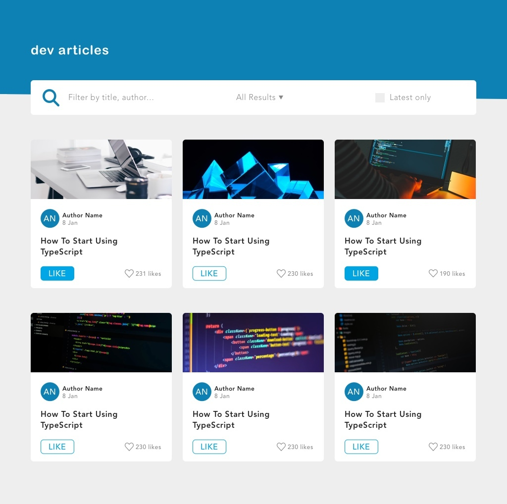

# Frontend Coding Challenge

## Willkommen
Für die Umsetzung der Aufgabe sollte ein JavaScript Framework verwendet werden. Vue.js wird bevorzugt, jedes andere moderne JavaScript Framework ist aber auch in Ordnung. Der Einsatz von TypeScript ist dabei optional. Kein CSS Framework (wie z.B. Bootstrap oder TailwindCSS) sollten eingesetzt werden, dass semantisches HTML verwendet wird.

Die Aufgabe ist so ausgelegt, dass sie in ungefähr 3 Stunden abgeschlossen werden kann.

## Aufgabenstellung

Bei dieser Aufgabe geht es um die Umsetzung eines responsiven Karten-Layouts, wobei die Karten gefiltert und sortiert werden können.
Die Daten der Kartensollten über eine API bezogen werden, aufgrund von CORS wurde der Response per JSON abgespeichert.

Das mitgelieferte Design, sowie die beschriebenen Funktionalitäten sollten umgesetzt werden. Zudem sollte auch die Applikation ausreichend getestet werden.

### Teil 1 - Design umsetzen

Im Verzeichnis `mockups` findest Du die umzusetzenden Layouts:

Die Liste von Karten sollte responsiv umgesetzt werden, wobei die maximale Breite des Content-Bereichs 920px und die minimale 320px betragen sollte.
Bei jedem Breakpoint sollte der zur Verfügung stehenden Platz optimal ausgenutzt werden. Das heißt auch, dass die Karten innerhalb eines Breakpoints die Größe verändern können sollen.

Das Gesamtlayout besteht aus einem Header mit Überschrift, einer Funktionsleiste und einer Liste mit Karten.

Die Funktionsleiste beinhaltet ein Suchfeld, ein Filter-Dropdown, sowie eine Checkbox.

Die einzelnen Karten sind folgendermaßen aufgebaut:

- Titelbild
- Autoren-Avatar (blauer Kreis mit Initialen des Autors)
- Name des Autors
- Erstellungsdatum des Artikels
- Titel des Beitrags
- Like-Button, welcher in Abhängigkeit des Zustands das Styling ändert (siehe `active-states.jpg`)
- Anzahl der Likes

Bitte verwende für die Umsetzung das folgende Color Scheme, dieses ist auch nochmal in der Datei `color-scheme.jpg` enthalten.

Die Daten für die Karten können über den Endpunkt XXX (Cors Error daher erstmal per JSON) abgefragt werden.

**Hinweise:**

- Die zu verwendenden Icons findest Du im Verzeichnis `assets`
- In den Designs wird unsere Brand Font (`AvenirNext`) verwendet, da diese proprietär ist, bitte eine andere verwenden

### Teil 2 - Funktionalität umsetzen

Bitte setze die nachfolgend beschriebenen Funktionen um.

**App Funktionen**

Über die Suchfunktion soll man nach Autoren und Titeln suchen können. Dabei sollen nur die gefilterten Karten angezeigt werden.

Die Beiträge sollen weiterhin über ein Dropdown nach Name des Autors (alphabetisch) oder Datum (auf- und absteigend) sortiert werden können.

Wenn die Checkbox aktiviert wird, sollen nur Beiträge aus dem aktuellen Jahr angezeigt werden.

**Card Funktionen**

Der User kann über einen Button den Beitrag liken/unliken. In Abhängigkeit davon ändert sich auch das Styling des Buttons (siehe `active-states.jpg`), sowie die Anzahl der Likes.

### Teil 3 - Tests schreiben
Bitte schreibe sinnvolle Tests für Deine Applikation.